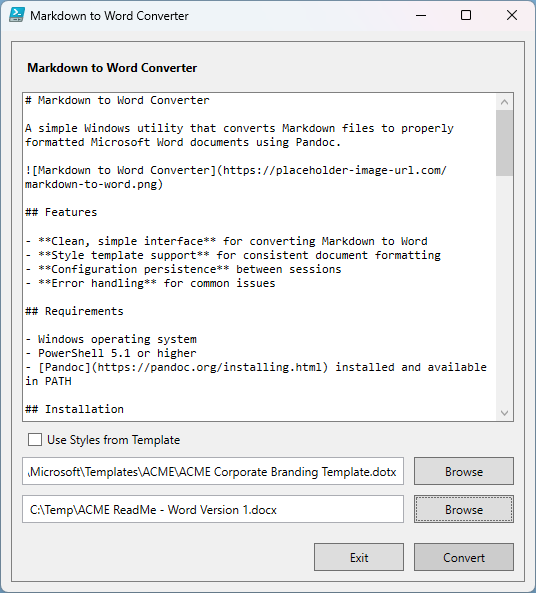

# Markdown to Word Converter

A simple Windows utility that converts Markdown content to professionally formatted Microsoft Word documents.

## Overview

This tool provides an easy-to-use interface for converting Markdown text to Word (.docx) documents. Simply paste your Markdown content, choose where to save the output file, and convert with a single click.

## Features

- Friendly user interface for editing and converting Markdown
- Apply professional formatting using Word templates
- Save your settings between sessions
- Simple error handling with helpful messages

## Requirements

- Windows operating system
- PowerShell 5.1 or higher
- [Pandoc](https://pandoc.org/installing.html) must be installed and available in your system PATH

## Getting Started

1. **Download and install Pandoc** from [pandoc.org/installing.html](https://pandoc.org/installing.html)
2. **Download** the `MarkdownToWord.ps1` script
3. **Remove the Mark of the Web** if needed by right-clicking the script file, selecting Properties, and ticking the "Unblock" checkbox near the bottom of the window
4. **Run the script** by right-clicking and selecting "Run with PowerShell"

## How to Use

1. **Enter your Markdown content** in the main text area
2. **Choose an output location** for your Word document using the Browse button
3. **Optional:** Select a Word template (.dotx or .docx) to use its styles
4. **Click Convert** to generate your Word document

## Styling Your Document

To apply consistent formatting:

1. Check the "Use Styles from Template" box
2. Select a Word document or template file
3. Your converted document will use the styles from this template

## Troubleshooting

### "Pandoc Not Found" Error

If you see this message:
- Make sure you've installed Pandoc
- Verify that Pandoc is in your system PATH
- Try restarting your computer after installation

### Permission Issues

If you can't save the output file:
- Check that you have write permission to the selected folder
- Try saving to your Documents folder instead
- Run PowerShell as administrator if needed

## Frequently Asked Questions

### Does this work on a Mac?

No, this specific PowerShell script is designed for Windows systems only. However, Pandoc itself (the underlying conversion tool) works on macOS, Linux, and Windows. Mac users can:
- Install Pandoc using Homebrew: `brew install pandoc`
- Use Pandoc directly from the command line: `pandoc -f markdown -t docx -o output.docx input.md`
- Consider alternative GUI applications for Markdown to Word conversion on macOS

### How do I reduce the Word document's file size?

If your converted document is larger than expected, this may be due to:
1. **Embedded fonts**: Pandoc or the original template document might embed fonts, increasing file size
2. **Hidden graphics**: Template documents sometimes contain graphics or other elements you don't need

To reduce file size:
- Open the generated document in Word
- Go to File > Options > Save
- Uncheck "Embed fonts in the file"
- Remove any unnecessary styles, graphics, or other elements
- Save as a new document

## Need More Help?

See the [Pandoc documentation](https://pandoc.org/MANUAL.html) for advanced usage information.
